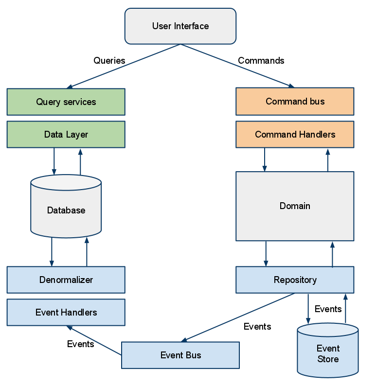
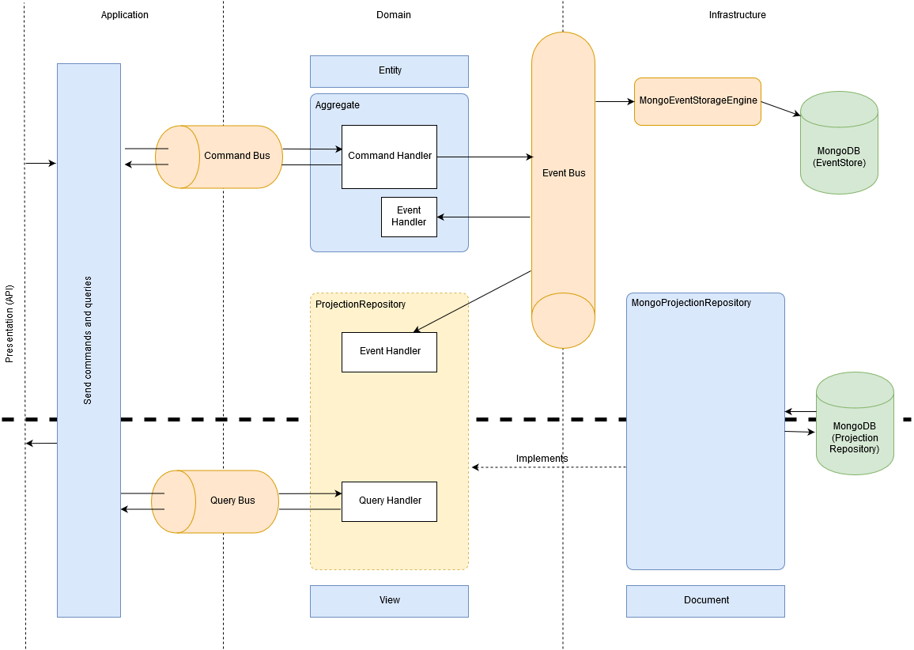

# Architecture hexagonale et CQRS

Le but de ce projet est de proposer une façon d'associer deux types architectures applicatives complémentaires issues du **DDD** : l'architecture *hexagonale* et l'architecture *CQRS*.

Il ne s'agit pas d'expliquer ce qu'est le DDD mais de démontrer comment ces deux architectures peuvent s'articuler. 

Il s'agit de l'architecture employée sur le projet [Hespérides](https://github.com/voyages-sncf-technologies/hesperides). Vous pouvez donc vous y référez pour avoir un exemple d'application plus complète et employée en production.

*Le CQRS a en partie été créé pour répondre à des problématiques liées à l'Event Sourcing. Il n'est pas indispensable de faire de l'Event Sourcing avec du CQRS mais les deux vont souvent de pair. Ici nous avons fait le choix d'utiliser les deux.*

## Cas d'utilisations

Les cas d'utilisations implémentés dans ce projet sont un simple CRUD Utilisateur.

## Contexte technique

* Le projet est implémenté sous forme d'API REST **SpringBoot**
* Nous utilisons le framework **Axon** pour gérer la partie *Event Sourcing*
* **Cucumber** est utilisé pour les tests de non-régression fonctionnels &rarr; [Features](tests/src/test/resources/users)
* **Travis** a été activé sur ce projet pour l'intégration continue &rarr; [Travis.yml](.travis.yml)

## Architecture hexagonale

L'architecture hexagonale mise en place est représentée par 4 couches :

 

 

### Présentation

La couche **Présentation** représente le point d'entrée de l'API. Elle contient les contrôleurs de l'application, effectue le contrôle des inputs et renvoie des outputs. C'est le contrat avec l'extérieur.

Elle a une dépendance vers la couche Application qui elle-même a une dépendance vers la couche Domaine. La couche Présentation a donc elle aussi accès à la couche Domaine.

### Application

La couche **Application** contient la logique applicative et sert à faire le lien entre plusieurs agrégats. *Les agrégats sont une notion centrale en DDD, nous y revenons dans la couche Domaine.*

### Domaine

Le **Domaine** contient la *logique Métier* de l'application et les entités du domaine regroupées en agrégats. Elle est autonome et ne dépend pas des autres couches.

Un *agrégat* est un ensemble d'entités que l'on peut voir comme une unité. Souvent, il porte le nom de son entité racine. Une *entité racine* est le point d'entrée d'un agrégat. Les autres entités n'ont pas lieu d'être sans cette entité racine.

Un exemple simple : l'adresse postale du client d'une boutique n'a pas d'intérêt seule. Client et Adresse sont deux entités distinctes qui forment un agrégat dont l'entité racine est Client. On peut nommer cet agrégat Client.

La couche Domaine contient aussi :
* Les interfaces (Repository, Service, etc.) implémentées dans la couche infrastructure
* La définition des Commands et Queries
* Les classes d'exceptions associées aux entités

### Infrastructure

Le domaine définit via les interfaces ce qui *doit* être fait. L'**infrastructure** implémente *comment* le faire.

Elle permet d'accéder aux partenaires externes. C'est ici qu'on trouve le "bruit technique" (accès à une base de données, à une ressource externe, envoi de mail, etc.). Les interfaces *génériques* définies dans la couche Domaine sont implémentées de manière *spécifique* dans la couche Infrastructure.

## (Event Sourcing et) CQRS

Schéma extrait du blog de [Clever Age](https://blog.clever-age.com/fr/2012/01/05/a-la-rencontre-d-une-architecture-meconnue-cqrs/)

Une architecture **CQRS** sépare de manière explicite la logique applicative contenant la gestion de l'écriture de celle de la lecture. Elle est souvent liée, comme dit précédemment, à la notion d'**Event Sourcing**.

Un aspect important du CQRS est de simplifier la lecture en préparant les données sous formes de vues lors de la phase d'écriture. Cela implique de gérer un maximum des traitements lors de l'écriture et un minimum lors de la lecture.

⚠️ Ce modèle a un impact sur la complexité du code. Il faut éviter de vouloir à tout prix tout préparer lors de l'écriture et faire au cas par cas.

## Architecture hexagonale et CQRS

Schéma de l'articulation des deux architectures :

 

Schéma issu du projet [Hespérides](https://github.com/voyages-sncf-technologies/hesperides/blob/master/documentation/architecture/cqrs_event_sourcing.md)

## Ressources

* Une introduction au DDD : [Domain-Driven Design Vite fait](https://www.infoq.com/fr/minibooks/domain-driven-design-quickly/)
* Deux introductions au _modèle_ CQRS :
  * [CQRS Introduction](https://cqrs.wordpress.com/documents/cqrs-introduction/) (Anglais)
  * [Pourquoi avoir choisi d’utiliser l’architecture CQRS ?](https://medium.com/tiller-systems/pourquoi-avoir-choisi-dutiliser-l-architecture-cqrs-e04c082f8b5f) (Français)
* Deux introductions aux tests BDD :
  * [OpenClassrooms](https://openclassrooms.com/fr/courses/3504461-testez-linterface-de-votre-site/4270566-apprenez-le-behavior-driven-development-bdd)
  * [Le BDD, qu’est ce que c’est?](https://www.arolla.fr/blog/2012/06/bdd-c-est-quoi-donc/)
